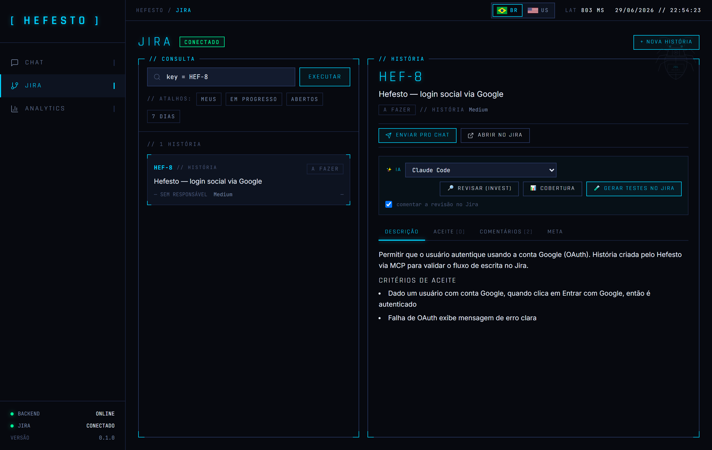
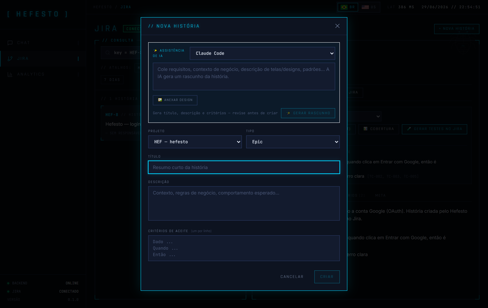
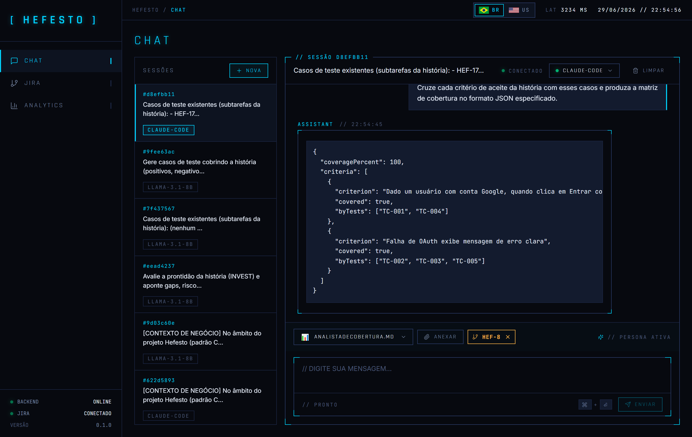
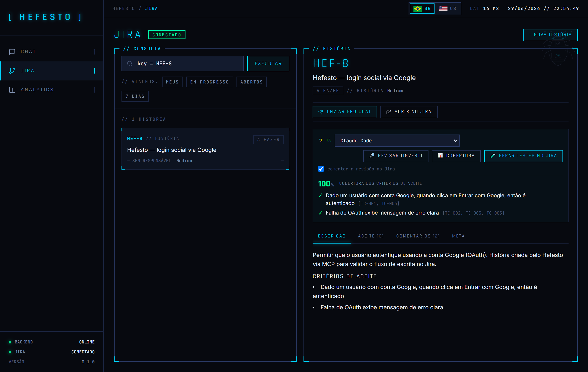
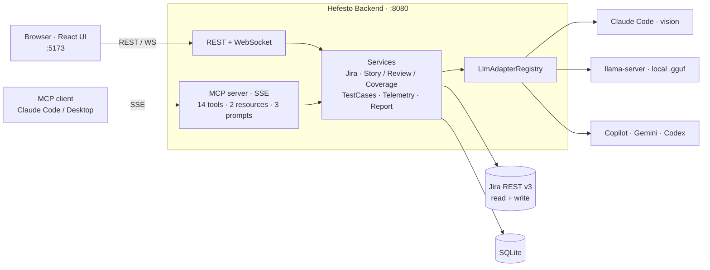

# Hefesto

> From idea to test, without switching tabs. An AI-assisted QA/PO platform, also
> exposed as an **MCP server**, that turns a requirement (text or a screenshot)
> into a Jira story, test cases and a coverage report.

```
   _   _   _____   _____   _____   _____   _____   _____
  | | | | |  ___| |  ___| | ____| |  ___| |_   _| |  _  |
  | |_| | | |__   | |__   | |__   | |__     | |   | | | |
  |  _  | |  __|  |  __|  |  __|  |___ \    | |   | | | |
  | | | | | |___  | |     | |___   ___) |   | |   | |_| |
  |_| |_| |_____| |_|     |_____| |____/    |_|   |_____|
```

[](LICENSE)
[](#getting-started)
[](#getting-started)
[](./docs/MCP.md)

[Português](./README.md) · **English**

<p align="center">
  
</p>

---

## Contents

- [Overview](#overview)
- [What it does](#what-it-does)
- [MCP server](#mcp-server)
- [Workflows](#workflows)
- [Getting started](#getting-started)
- [Architecture and stack](#architecture-and-stack)
- [Specialist agents](#specialist-agents)

---

## Overview

Write the story, review it, create the test cases, attach evidence, update Jira.
On paper it's simple; in practice it becomes a back-and-forth across chat, Jira,
spreadsheet and document, each one losing the previous context. Hefesto closes
that loop in one place, with AI doing the heavy lifting and Jira as the source of
truth.

From a requirement in **text or even a screenshot**, Hefesto:

1. **writes the story** (title, description and acceptance criteria);
2. **assesses its readiness** with the INVEST criteria (gaps, risks, score);
3. **generates the test cases** and creates them as Jira subtasks;
4. **measures coverage** of the criteria by the tests, flagging what's missing.

And it does this in two ways. Through the **web interface**, in a guided
end-to-end flow. And through **natural language**: since the backend is also an
**MCP server**, the same power lives inside your Claude Code/Desktop (*"analyze
this requirement, create the story in project X and generate the test cases as
subtasks"*), without leaving the editor.

Built for **QA, devs and POs** who already use AI day to day and want to stop
stitching context by hand.

## What it does

**From requirement to story, with AI.** Paste the requirement or attach the screen
design. Hefesto understands what's in the image (fields, buttons, flows) and
returns a ready story: title, value-oriented description and testable acceptance
criteria. Review and create it in Jira in one click.

**Quality before code.** The readiness review applies the **INVEST** criteria and
returns a 0 to 100 score with gaps, risks and missing criteria. If you want, it posts
it all as a comment on the issue. The team starts development with the story
already mature.

**Traceable testing.** Test generation creates **one subtask per case** under the
story, in the `TC-NNN` format. Then the **coverage matrix** crosses acceptance
criteria with the tests and shows, in black and white, which criteria are still
uncovered: the kind of spreadsheet a senior QA builds by hand.

**Real Jira (read and write).** JQL search, reading of
description/criteria/comments, and full writing: create, update, transition and
comment on issues and subtasks (REST API v3), with localized issue types.

**Multi-LLM, offline included.** Pick the model per task: Claude (default, and the
vision model for images), **local `.gguf` models** via `llama-server` (100%
offline, no cloud), Copilot via the VS Code extension. Switching models is a
dropdown; adding a new one is implementing an interface.

**Execution and evidence.** Interactive cards per case, evidence attachments
(screenshots/logs), an HTML/PDF report with summary and inline evidence, and an
Analytics dashboard (KPIs, latency, time series). All in SQLite, no infrastructure.

<p align="center">
  
  &nbsp;
  
</p>
<p align="center"><sub>Create a story with AI (left) · multi-model chat with agents (right)</sub></p>

## MCP server

The backend isn't just a web API: it **is an MCP server** (over SSE). Any MCP
client, such as Claude Code or Claude Desktop, can drive Hefesto in natural
language, and the prompts become ready-made shortcuts in the client.

```bash
# Claude Code (native SSE transport)
claude mcp add --transport sse hefesto http://localhost:8080/sse
```

- **14 tools**, e.g. `jira_search`, `jira_create_story`, `review_story`,
  `generate_test_cases`, `create_test_subtasks`, `coverage_report`, `chat`.
- **2 resources**: `hefesto://agents`, `hefesto://models` (context the client pulls in).
- **3 prompts**: `revisar_historia`, `gerar_testes_no_jira`, `rascunhar_historia`.

Endpoints: `GET /sse` + `POST /mcp/message`. Full reference in
[docs/MCP.md](./docs/MCP.md).

## Workflows

### PO → QA flow, from requirement to coverage

In the **Jira** tab:

1. **New story**: paste the requirement or attach a screenshot. The AI generates
   the draft (title, description, criteria); adjust it, pick project/type and create.
2. **Review (INVEST)**: readiness score with gaps, risks and missing criteria,
   optionally commented on Jira.
3. **Generate tests in Jira**: the cases become subtasks of the story.
4. **Coverage**: criteria × tests matrix, highlighting what's uncovered.

The same flow runs in natural language via MCP (see [docs/MCP.md](./docs/MCP.md)).

<p align="center">
  
</p>
<p align="center"><sub>Coverage matrix: acceptance criteria × test cases, with the uncovered ones flagged</sub></p>

### Test execution flow

Create a chat session with the QA Senior agent, attach the manual and the Jira
issue as context, ask for the test cases (they arrive as interactive cards),
execute and mark each one, attach the evidence and generate the print-ready HTML
report.

## Getting started

### Requirements

- **Java 17+** and **Maven 3.9+** (backend), **Node.js 20 LTS+** (frontend)
- **Claude Code CLI** installed and logged in (`claude --version`): default
  adapter and the vision model used for drafting from an image
- *(Optional)* **Atlassian Cloud account** with API token, for Jira
- *(Optional)* **`llama-server`** ([llama.cpp](https://github.com/ggml-org/llama.cpp))
  + `.gguf` models, to run local models offline
- *(Optional)* **VS Code + GitHub Copilot** with the Hefesto Bridge extension

### Run the project

```bash
git clone https://github.com/SEU_USUARIO/hefesto.git
cd hefesto

# Backend → http://localhost:8080
cd hefesto-backend && mvn spring-boot:run

# Frontend (another terminal) → http://localhost:5173
cd hefesto-frontend && npm install && npm run dev
```

The [`agentes/`](./agentes) folder ships with 9 agents. Edit the `.md` files or
create new ones. Reload with `curl -X POST http://localhost:8080/api/agents/reload`,
no restart needed.

### Configure credentials

Credentials live in `hefesto-backend/src/main/resources/application-local.yml`
(gitignored). To use Jira:

```yaml
claude:
  cli:
    path: /path/to/claude           # Windows: C:\Users\...\claude.exe

jira:
  url: https://yourcompany.atlassian.net
  email: you@company.com
  token: "API_TOKEN_FROM_ATLASSIAN_ID"
```

Token: [id.atlassian.com/manage-profile/security/api-tokens](https://id.atlassian.com/manage-profile/security/api-tokens).
Restart the backend after saving. For local models, start `llama-server` with
[`scripts/start-llama-servers.bat`](./scripts/start-llama-servers.bat).

## Architecture and stack

The UI and MCP clients come in through different paths (REST/WebSocket and SSE)
but land on the **same services**: the business logic is shared, not duplicated.
The model layer is pluggable, each LLM is an `LlmAdapter`.



### Stack

**Backend**


**Frontend**


**VS Code extension**: TypeScript, VS Code Language Model API.

Details in [hefesto-backend/README.md](./hefesto-backend/README.md) and
[docs/MCP.md](./docs/MCP.md).

## Specialist agents

Each agent is a **`.md` file in [`agentes/`](./agentes)**, no code changes, with
hot reload. The frontmatter defines metadata; the body is the system prompt.

```markdown
---
description: "Senior test case designer"
defaultPromptTemplate: "Analyze and generate test cases."
extractsTestCases: true
---

You are a senior QA Specialist. Your mission is...
```

| File | Persona |
|---|---|
| `QAseniorAgent.md` | Senior QA, generates structured test cases |
| `EscritorDeHistorias.md` | Drafts a story from a requirement or image |
| `RevisorDeHistorias.md` | Assesses readiness (INVEST) with score, gaps and risks |
| `AnalistaDeCobertura.md` | Crosses acceptance criteria with test cases |
| `AnalistaDeNegocios.md` | Reviews Jira stories (clarity, completeness, gaps) |
| `TechWriter.md` · `Arquiteto.md` · `CodeReviewer.md` · `Default.md` | Documentation, technical analysis, code review, general assistant |

Full documentation: [agentes/README.md](./agentes/README.md).

## Contributing

See [CONTRIBUTING.md](./CONTRIBUTING.md): `feat/`/`fix/`/`docs/` branches,
conventional commits, tests for adapters and parsers, no committed credentials.
For a new agent, open a PR adding a `.md` to `agentes/`.

## License

[MIT](./LICENSE). Use, modify, distribute. Attribution appreciated, not required.

---

> Module docs: [docs/MCP.md](./docs/MCP.md) ·
> [hefesto-backend/README.md](./hefesto-backend/README.md) ·
> [hefesto-frontend/README.md](./hefesto-frontend/README.md) ·
> [hefesto-bridge-extension/README.md](./hefesto-bridge-extension/README.md) ·
> [agentes/README.md](./agentes/README.md)
