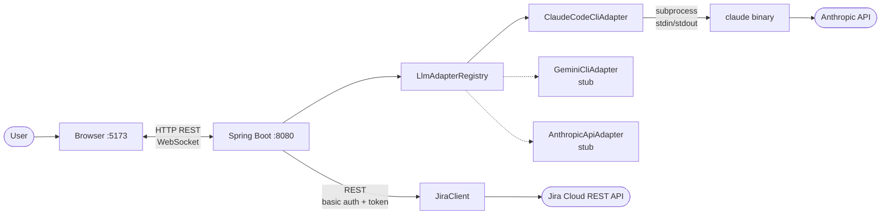
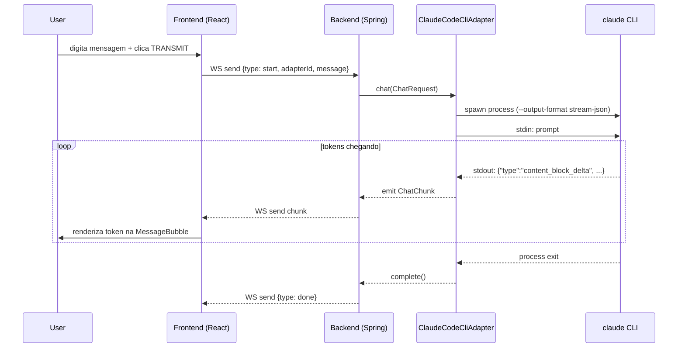
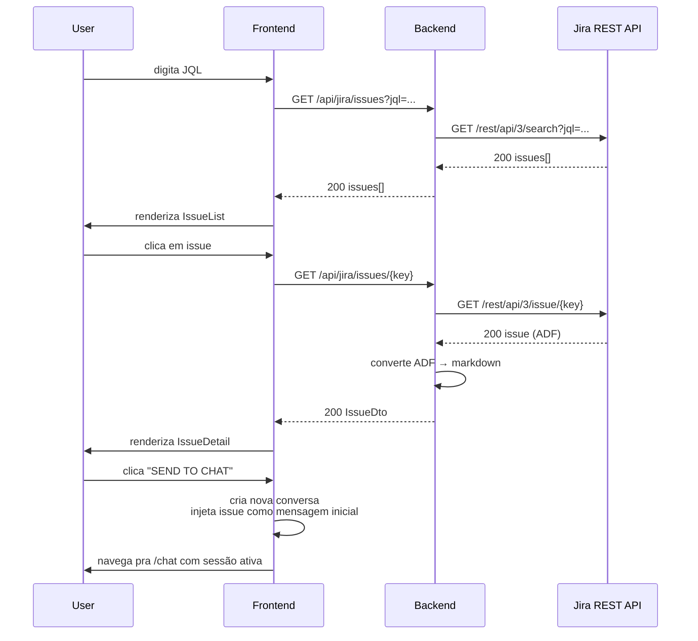

# Hefesto

> **// JIRA × LLM CONSOLE**
> Interface web pra conversar com chatbots de LLM (Claude Code e outros CLIs futuros) e integrar com o Jira pra usar histórias como contexto da conversa.

```
   _   _   _____   _____   _____   _____   _____   _____
  | | | | |  ___| |  ___| | ____| |  ___| |_   _| |  _  |
  | |_| | | |__   | |__   | |__   | |__     | |   | | | |
  |  _  | |  __|  |  __|  |  __|  |___ \    | |   | | | |
  | | | | | |___  | |     | |___   ___) |   | |   | |_| |
  |_| |_| |_____| |_|     |_____| |____/    |_|   |_____|

         JIRA × LLM CONSOLE — v0.1.0 // STAGE 1
```

---

## Sumário

- [O que é](#o-que-é)
- [Status atual e roadmap](#status-atual-e-roadmap)
- [Arquitetura](#arquitetura)
- [Stack](#stack)
- [Estrutura de pastas](#estrutura-de-pastas)
- [Pré-requisitos](#pré-requisitos)
- [Como rodar](#como-rodar)
- [Como usar](#como-usar)
- [Configuração](#configuração)
- [Convenções de desenvolvimento](#convenções-de-desenvolvimento)
- [Adicionando um novo adapter de LLM](#adicionando-um-novo-adapter-de-llm)
- [Troubleshooting](#troubleshooting)
- [Licença](#licença)

---

## O que é

Hefesto é uma estação de trabalho local que junta três coisas em uma única interface web:

1. **Chat com LLM via CLI**, começando pelo Claude Code da Anthropic. O backend faz o spawn do binário `claude` como subprocesso e expõe a conversa por WebSocket pro frontend.
2. **Integração com Jira Cloud**, permitindo buscar issues por JQL, abrir o detalhe completo (descrição, critérios de aceite, comentários) e injetar esse conteúdo como contexto inicial do chat.
3. **Volta pro Jira**, postando resumos da conversa de volta como comentários na issue de origem.

A arquitetura central é uma camada de **adapters** — cada LLM (Claude Code, Gemini, Codex, API direta) implementa a mesma interface `LlmAdapter`, e o frontend pode listar/selecionar qual usar. No MVP só o adapter do Claude Code está implementado; os demais ficam como stubs prontos pra crescer.

O foco é **uso local single-user**: você roda backend e frontend na sua máquina, configura suas credenciais Jira no `application-local.yml`, e usa como uma ferramenta pessoal de produtividade. Sem login, sem multi-tenant, sem deploy.

---

## Status atual e roadmap

O projeto está sendo construído em 7 etapas, validadas uma por vez.

| # | Etapa | Status | O que entrega |
|---|-------|--------|---------------|
| 1 | Bootstrap + design system | ✅ Concluída | Backend Spring Boot com health check; frontend completo com app shell, design system FUI, navegação entre 3 rotas, tokens de cor, tipografia, componentes UI base. |
| 2 | LlmAdapter + chat síncrono | 🔜 Próxima | Interface `LlmAdapter`, registro, `ClaudeCodeCliAdapter` rodando `claude -p` via subprocesso. `POST /api/chat` retorna resposta completa. ChatWindow visual com MessageList e Composer. |
| 3 | Streaming via WebSocket | 📋 Planejada | Troca pra `claude --output-format stream-json`, parsing de chunks, WS `/ws/chat`. Frontend renderiza tokens em tempo real com cursor piscando. |
| 4 | Jira leitura | 📋 Planejada | `JiraClient` com auth básica + token, endpoints de busca e detalhe, conversão de ADF→markdown. JiraPage com JqlSearchBar, IssueList e IssueDetail com tabs. |
| 5 | Issue → contexto do chat | 📋 Planejada | Botão "Send to chat" injeta a issue como primeira mensagem da conversa. |
| 6 | Postar comentário no Jira | 📋 Planejada | Endpoint `POST /api/jira/issues/{key}/comments`. Botão "Save summary" gera resumo via LLM e posta de volta. |
| 7 | Polimento + testes | 📋 Planejada | Cobertura de testes mínima, lint, fechamento do MVP. |

Roadmap detalhado: [PROMPT_CLAUDE_CODE.md](./PROMPT_CLAUDE_CODE.md).

---

## Arquitetura

### Visão geral



### Como o backend conversa com o LLM

A peça central é a interface `LlmAdapter`:

```java
public interface LlmAdapter {
    String id();
    String displayName();
    boolean isAvailable();
    Flux<ChatChunk> chat(ChatRequest request);
}
```

Cada implementação concreta sabe falar com um LLM específico. A primeira (e única implementada no MVP) é `ClaudeCodeCliAdapter`, que faz **spawn de processo**: dispara o binário `claude` instalado localmente, manda o prompt via stdin (modo `--output-format stream-json`), e lê chunks JSON do stdout linha a linha. Cada linha vira um `ChatChunk` que o backend retransmite ao frontend pela conexão WebSocket.

O `LlmAdapterRegistry` é um bean Spring que injeta todos os `LlmAdapter` registrados como beans e expõe `list()` (pro frontend listar opções no dropdown) e `get(id)` (pro `ChatService` resolver qual usar pra cada request).

Stubs como `GeminiCliAdapter`, `CodexCliAdapter` e `AnthropicApiAdapter` ficam registrados mas com `isAvailable() = false`, prontos pra serem implementados depois sem refatorar nada.

### Fluxo de uma mensagem de chat



### Fluxo de integração com Jira



### Por que arquitetura em adapters?

Você expressou que quer poder **selecionar o CLI** (Claude Code hoje, talvez Gemini ou Codex amanhã, talvez ir direto na API). Em vez de tratar Claude Code como caso especial e depois ter que reescrever tudo, o adapter pattern garante:

- **Frontend agnóstico** — o React só conhece `{adapterId, displayName, available}` e troca o adapter num dropdown.
- **Backend extensível** — adicionar Gemini é criar uma classe nova que implementa `LlmAdapter`, registrar como `@Component`, pronto. O `LlmAdapterRegistry` descobre automaticamente.
- **Testabilidade** — `ClaudeCodeCliAdapter` recebe um abstrator de processo injetável; nos testes você mocka o subprocess sem precisar do binário real instalado.
- **Sem vendor lock-in** — se a Anthropic mudar a CLI, você atualiza um adapter; se quiser usar Bedrock ou Vertex, escreve um adapter; se quiser bater na API REST direto, idem.

---

## Stack

| Camada | Tecnologia | Por quê |
|--------|------------|---------|
| Backend runtime | Java 17 | LTS suportada pelo Spring Boot 3.x. |
| Backend framework | Spring Boot 3.4 | Ecossistema maduro, WebSocket nativo, fácil de integrar com Jira via `RestClient`. |
| Build backend | Maven | Familiar, sem surpresas, integra bem com IDEs Java. |
| LLM integration | Spawn de subprocesso (Claude Code CLI) | Mantém compatibilidade total com o `claude` que você já usa no terminal; permite trocar por outros CLIs sem mexer em SDK. |
| Frontend runtime | React 18 + TypeScript | Padrão de mercado, fortemente tipado, mesma stack do SOC. |
| Frontend bundler | Vite | Hot reload instantâneo, build rápido, dev experience superior ao CRA. |
| Estilo | Tailwind CSS + tokens custom | Tokens em CSS variables permitem temas/skins; classes utilitárias evitam CSS sprawl. |
| Estado servidor | TanStack Query (React Query) | Cache, refetch, retry e loading states sem código manual. |
| Estado UI | Zustand | Mais leve e simples que Redux; ideal pra estado local da UI. |
| Roteamento | React Router 6 | Padrão. |
| Animações | Framer Motion | Transições suaves entre rotas e estados de chat. |
| Ícones | Lucide React | Linha fina, casa com a estética FUI. |
| Tipografia | Rajdhani / JetBrains Mono / Inter | Display técnica + mono pra dados + sans pra leitura. |
| Persistência | **Nenhuma no MVP** | Conversas em memória. Banco entra só se houver demanda real. |

---

## Estrutura de pastas

```
hefesto/
├── README.md                       # este arquivo
├── PROMPT_CLAUDE_CODE.md           # roadmap completo das 7 etapas
├── .gitignore
│
├── hefesto-backend/                # módulo Maven Spring Boot
│   ├── README.md                   # docs específicas do backend
│   ├── pom.xml
│   └── src/
│       └── main/
│           ├── java/com/hefesto/
│           │   ├── HefestoApplication.java
│           │   ├── config/                 # CorsConfig, properties
│           │   ├── health/                 # HealthController
│           │   ├── llm/                    # [Etapa 2] Adapter, Registry, ChatRequest
│           │   │   └── adapters/           # [Etapa 2+] ClaudeCodeCliAdapter, stubs
│           │   ├── jira/                   # [Etapa 4] JiraClient, JiraService
│           │   └── chat/                   # [Etapa 2] ChatController, ChatService
│           └── resources/
│               └── application.yml
│
└── hefesto-frontend/               # projeto npm/Vite React
    ├── README.md                   # docs específicas do frontend
    ├── package.json
    ├── vite.config.ts
    ├── tsconfig.json
    ├── tailwind.config.ts
    ├── index.html
    └── src/
        ├── main.tsx
        ├── App.tsx
        ├── routes.tsx
        ├── theme/                  # tokens.css, globals.css
        ├── components/
        │   ├── ui/                 # Frame, Panel, Button, Input, etc.
        │   ├── shell/              # Sidebar, TopBar, AppShell
        │   ├── chat/               # [Etapa 2+] ChatWindow, MessageList, Composer
        │   └── jira/               # [Etapa 4+] IssueList, IssueDetail
        ├── pages/                  # ChatPage, JiraPage, SettingsPage
        ├── api/                    # http.ts, health.ts (chat.ts e jira.ts depois)
        ├── hooks/                  # useHealth, useClock
        ├── store/                  # [Etapa 2+] zustand stores
        └── lib/                    # cn.ts e utilitários
```

Pastas marcadas com `[Etapa X]` ainda não existem — serão criadas conforme as etapas avançam.

---

## Pré-requisitos

| Ferramenta | Versão mínima | Como verificar |
|------------|---------------|----------------|
| Java JDK | 17 (LTS) | `java -version` |
| Maven | 3.9+ | `mvn -v` |
| Node.js | 20 LTS+ | `node -v` |
| npm | 10+ (vem com Node 20) | `npm -v` |
| Claude Code CLI | qualquer versão recente | `claude --version` |

> O Claude Code CLI só é necessário a partir da **Etapa 2**. Pra rodar a Etapa 1 (atual) você precisa só de Java + Maven + Node.

### Instalando o Claude Code CLI

Siga as instruções oficiais em [https://docs.claude.com/claude-code](https://docs.claude.com/claude-code). Confirme que `claude --version` responde no terminal antes de iniciar a Etapa 2.

---

## Como rodar

### Modo desenvolvimento (recomendado)

Abra dois terminais.

**Terminal 1 — backend:**

```bash
cd hefesto-backend
mvn spring-boot:run
```

Sobe em `http://localhost:8080`. Confirme com:

```bash
curl http://localhost:8080/api/health
# {"status":"ok","ts":1761411600000,"service":"hefesto-backend","version":"0.1.0"}
```

**Terminal 2 — frontend:**

```bash
cd hefesto-frontend
npm install     # só na primeira vez
npm run dev
```

Abra `http://localhost:5173` no navegador. O Vite faz proxy de `/api/*` e `/ws/*` pro backend automaticamente, então você não precisa lidar com CORS no dia a dia.

### Build de produção (apenas backend, por enquanto)

```bash
cd hefesto-backend
mvn clean package
java -jar target/hefesto-backend-0.1.0-SNAPSHOT.jar
```

Pra produção real (frontend buildado servido pelo Spring), o roadmap tem como item futuro plugar o `frontend-maven-plugin` no pom raiz e copiar o `dist/` do Vite pra `src/main/resources/static/`. Por enquanto, dev mode é o caminho.

### Parando

`Ctrl+C` em cada terminal.

---

## Como usar

### Etapa atual (Stage 1)

Você consegue:

- Abrir a interface no navegador.
- Ver o **AppShell** com sidebar (logo `[ HEFESTO ]`, nav `CHAT / JIRA / SETTINGS`, status do backend pulsando ao vivo).
- Ver a **TopBar** com breadcrumb dinâmico, latência da última request HTTP e relógio UTC atualizando a cada segundo.
- Navegar entre as 3 rotas — cada uma renderiza um placeholder estilizado mostrando o estado da etapa.
- Ver o `SystemStatus` no rodapé da sidebar reagir em tempo real ao estado do backend (verde quando ON, vermelho quando OFF; pare o `mvn` e veja virar offline em ~10s).
- Inspecionar a `SettingsPage` que já mostra dados live do health check (service, version) e tem o form de Jira renderizado em estado disabled.

### Etapas futuras (resumo do fluxo de uso completo)

Quando o MVP estiver pronto, o fluxo típico será:

1. Configurar credenciais Jira em `Settings`.
2. Ir em `Jira`, executar uma busca JQL (ex: `assignee = currentUser() AND status = "In Progress"`).
3. Clicar numa issue, ler descrição/critérios de aceite/comentários.
4. Clicar em `[ SEND TO CHAT ]` — Hefesto cria uma nova sessão com a issue injetada como contexto.
5. Conversar com o Claude Code (analisar o problema, gerar código, decidir abordagem, etc.).
6. Quando terminar, clicar em `[ POST SUMMARY TO JIRA ]` — Hefesto pede ao LLM um resumo da conversa, mostra preview, e ao confirmar posta como comentário na issue original.

---

## Configuração

Toda configuração sensível fica em `hefesto-backend/src/main/resources/application-local.yml` (no `.gitignore`) ou em variáveis de ambiente.

### Variáveis suportadas

| Variável | Descrição | Default | Etapa |
|----------|-----------|---------|-------|
| `SERVER_PORT` | Porta do backend | `8080` | 1 |
| `CLAUDE_CLI_PATH` | Caminho pro binário `claude` | `claude` (PATH) | 2 |
| `JIRA_URL` | URL da instância Jira Cloud | — | 4 |
| `JIRA_EMAIL` | Email da conta Atlassian | — | 4 |
| `JIRA_TOKEN` | API token gerado em [id.atlassian.com/manage-profile/security/api-tokens](https://id.atlassian.com/manage-profile/security/api-tokens) | — | 4 |

### Exemplo de `application-local.yml` (Etapa 4+)

```yaml
claude:
  cli:
    path: /usr/local/bin/claude

jira:
  url: https://yourcompany.atlassian.net
  email: you@yourcompany.com
  token: ATATT3xFfGF0...
```

> **Nunca comite credenciais.** O `.gitignore` raiz já bloqueia `application-local.yml`, `.env` e `.env.local`. Se em dúvida, rode `git status` antes de commitar.

---

## Convenções de desenvolvimento

### Commits

Conventional Commits:

- `feat:` — funcionalidade nova
- `fix:` — correção de bug
- `chore:` — config, infra, deps
- `test:` — adicionar/ajustar testes
- `style:` — formatação, sem mudança de comportamento
- `refactor:` — reorganizar sem mudar comportamento
- `docs:` — README, comentários

Um commit por etapa do roadmap durante o MVP. Detalhes no corpo se necessário.

### Branch

MVP roda em `main`. Quando estiver maduro, migra pra fluxo `feature/* → main` com PRs.

### Testes

- **Backend**: JUnit 5 + Mockito. Cobertura mínima por etapa: o adapter da etapa, o controller da etapa, o service da etapa.
- **Frontend**: Vitest + React Testing Library. Cobertura mínima: componentes UI base e componentes de página com lógica não-trivial.

Rode com:

```bash
cd hefesto-backend && mvn test
cd hefesto-frontend && npm test
```

### Formatação

- Backend: 4 espaços, padrão Spring/google-java-format.
- Frontend: 2 espaços, padrão Prettier (config a adicionar quando lint chegar).

### Estilo de código (frontend)

- Componentes em PascalCase, um por arquivo.
- Hooks customizados em camelCase com prefixo `use`.
- Imports absolutos via alias `@/` (configurado em `vite.config.ts` e `tsconfig.json`).
- Props tipadas com `interface`, não `type`, exceto quando precisar de unions/intersections.
- Tailwind primeiro; CSS custom só quando arbitrary values não dão conta (animações, pseudo-elementos complexos).

---

## Adicionando um novo adapter de LLM

> Disponível a partir da Etapa 2.

Suponha que você queira adicionar suporte ao Gemini CLI. Passos:

1. Crie `hefesto-backend/src/main/java/com/hefesto/llm/adapters/GeminiCliAdapter.java`:

   ```java
   @Component
   public class GeminiCliAdapter implements LlmAdapter {
       @Override public String id() { return "gemini-cli"; }
       @Override public String displayName() { return "Gemini CLI"; }
       @Override public boolean isAvailable() {
           // tentar `gemini --version` num ProcessBuilder
       }
       @Override public Flux<ChatChunk> chat(ChatRequest request) {
           // spawn `gemini` com flags equivalentes, parsear stdout
       }
   }
   ```

2. Não precisa registrar em lugar nenhum — o `LlmAdapterRegistry` injeta todos os `@Component` que implementam `LlmAdapter` automaticamente.

3. (Opcional) Adicione propriedade `gemini.cli.path` no `application.yml`.

4. Reinicie o backend. O frontend já vai listar o novo adapter no dropdown.

5. Escreva um teste em `src/test/java/com/hefesto/llm/adapters/GeminiCliAdapterTest.java` mockando o processo.

---

## Troubleshooting

**`mvn spring-boot:run` falha com erro de versão de Java.**
Confirme com `java -version` que está em 17. Em macOS com várias versões: `export JAVA_HOME=$(/usr/libexec/java_home -v 17)`. No Windows, ajuste a variável de ambiente `JAVA_HOME` apontando pro JDK 17 e `%JAVA_HOME%\bin` no PATH.

**`npm install` reclamando de versão do Node.**
Use Node 20 LTS+. Com nvm: `nvm install 20 && nvm use 20`.

**StatusDot do BACKEND ficou vermelho.**
O hook `useHealth` faz polling em `/api/health` a cada 10s. Verifique:
- Backend está rodando? (`curl localhost:8080/api/health`)
- Porta 8080 ocupada por outro processo? (`lsof -i :8080`)
- Console do browser mostra erro de CORS? Se sim, pode ser que o proxy do Vite caiu — reinicie `npm run dev`.

**CORS errors no console.**
Em dev, você acessa só `localhost:5173` e o Vite proxy intermedia tudo. Se aparecer CORS, provavelmente alguém chamou direto `http://localhost:8080` em vez do path relativo `/api/...`. Procure essa chamada e corrija.

**Build do frontend reclama de tipo.**
TypeScript é strict. Rode `npm run build` localmente antes de commitar pra capturar.

**Etapa 2+: o adapter do Claude Code não funciona.**
Confirme que `claude --version` responde. Se está em PATH não-padrão, configure `CLAUDE_CLI_PATH` no `application-local.yml`. Veja logs do backend (`logging.level.com.hefesto: DEBUG`) pra ver o comando exato sendo executado.

**Etapa 4+: 401 Unauthorized do Jira.**
- Token expirou ou foi revogado? Gere um novo em [id.atlassian.com/manage-profile/security/api-tokens](https://id.atlassian.com/manage-profile/security/api-tokens).
- Email correto? Tem que ser o email da conta Atlassian, não user/login interno.
- URL com `https://` e sem `/` no fim.

---

## Licença

Projeto pessoal, sem licença pública por enquanto. Todos os direitos reservados pelo autor.

---

> Para detalhes específicos de cada módulo, veja:
> - [hefesto-backend/README.md](./hefesto-backend/README.md) — pacotes Java, contrato de adapter, testes.
> - [hefesto-frontend/README.md](./hefesto-frontend/README.md) — design system, componentes, theming.
# hefesto
