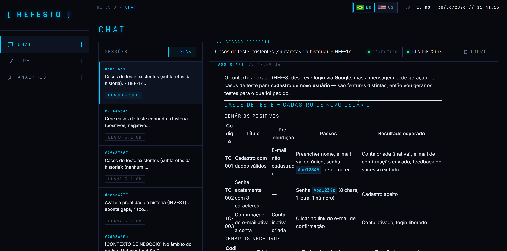
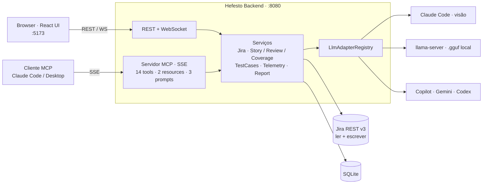

# Hefesto

> Da ideia ao teste, sem trocar de aba. Uma plataforma de QA/PO assistida por IA,
> também exposta como **servidor MCP**, que transforma um requisito (texto ou
> print de tela) em história no Jira, casos de teste e relatório de cobertura.

```
   _   _   _____   _____   _____   _____   _____   _____
  | | | | |  ___| |  ___| | ____| |  ___| |_   _| |  _  |
  | |_| | | |__   | |__   | |__   | |__     | |   | | | |
  |  _  | |  __|  |  __|  |  __|  |___ \    | |   | | | |
  | | | | | |___  | |     | |___   ___) |   | |   | |_| |
  |_| |_| |_____| |_|     |_____| |____/    |_|   |_____|
```

[](LICENSE)
[](#começando)
[](#começando)
[](./docs/MCP.md)

**Português** · [English](./README.en.md)

<p align="center">
  
</p>

---

## Sumário

- [Visão geral](#visão-geral)
- [O que faz](#o-que-faz)
- [Servidor MCP](#servidor-mcp)
- [Fluxos de trabalho](#fluxos-de-trabalho)
- [Começando](#começando)
- [Arquitetura e stack](#arquitetura-e-stack)
- [Agentes especialistas](#agentes-especialistas)

---

## Visão geral

Escrever a história, revisar, criar os casos de teste, anexar evidência, atualizar
o Jira. No papel é simples; na prática vira um vaivém entre chat, Jira, planilha e
documento, cada um perdendo contexto do anterior. O Hefesto fecha esse ciclo num
lugar só, com a IA fazendo o trabalho pesado e o Jira como fonte da verdade.

A partir de um requisito em **texto ou até um print de tela**, o Hefesto:

1. **escreve a história** (título, descrição e critérios de aceite);
2. **avalia a prontidão** dela com critério INVEST (gaps, riscos, score);
3. **gera os casos de teste** e os cria como subtarefas no Jira;
4. **mede a cobertura** dos critérios pelos testes, apontando o que ficou de fora.

E faz isso de dois jeitos. Pela **interface web**, num fluxo guiado de ponta a
ponta. E por **linguagem natural**: como o backend é também um **servidor MCP**, o
mesmo poder está dentro do seu Claude Code/Desktop (*"analise este requisito, crie
a história no projeto X e gere os casos de teste como subtarefas"*), sem sair do
editor.

Feito para **QA, dev e PO** que já usam IA no dia a dia e querem parar de costurar
contexto na mão.

## O que faz

**Do requisito à história, com IA.** Cole o requisito ou anexe o design da tela.
O Hefesto entende o que está na imagem (campos, botões, fluxos) e devolve uma
história pronta: título, descrição no formato de valor e critérios de aceite
testáveis. Revise e crie no Jira em um clique.

**Qualidade antes do código.** A revisão de prontidão aplica o critério **INVEST**
e devolve um score de 0 a 100 com gaps, riscos e critérios faltantes. Se você
quiser, registra tudo como comentário na própria issue. O time entra no
desenvolvimento com a história já madura.

**Teste rastreável.** A geração de casos cria **uma subtarefa por caso** sob a
história, no formato `TC-NNN`. Em seguida, a **matriz de cobertura** cruza
critérios de aceite com os testes e mostra, preto no branco, quais critérios ainda
estão descobertos: o tipo de planilha que QA sênior monta na mão.

**Jira de verdade (ler e escrever).** Busca por JQL, leitura de
descrição/critérios/comentários e escrita completa: criar, atualizar, transicionar
e comentar issues e subtarefas (REST API v3), com tipos já localizados.

**Multi-LLM, inclusive offline.** Escolha o modelo por tarefa: Claude (oficial, e o
de visão para imagens), **modelos locais `.gguf`** via `llama-server` (100%
offline, sem nuvem), Copilot via extensão VS Code. Trocar de modelo é um dropdown;
adicionar um novo é implementar uma interface.

**Execução e evidências.** Cards interativos por caso, anexo de evidências
(screenshots/logs), relatório HTML/PDF com sumário e evidências inline, e um
dashboard de Analytics (KPIs, latência, série temporal). Tudo em SQLite, sem
infraestrutura.

<p align="center">
  
</p>
<p align="center"><sub>Criar história com IA, a partir de texto ou de uma imagem de tela</sub></p>

## Servidor MCP

O backend não é só uma API web: ele **é um servidor MCP** (sobre SSE). Qualquer
cliente MCP, como Claude Code ou Claude Desktop, passa a operar o Hefesto por
linguagem natural, e os prompts viram atalhos prontos no cliente.

```bash
# Claude Code (transporte SSE nativo)
claude mcp add --transport sse hefesto http://localhost:8080/sse
```

- **14 tools**, ex.: `jira_search`, `jira_create_story`, `review_story`,
  `generate_test_cases`, `create_test_subtasks`, `coverage_report`, `chat`.
- **2 resources**: `hefesto://agents`, `hefesto://models` (contexto que o cliente puxa).
- **3 prompts**: `revisar_historia`, `gerar_testes_no_jira`, `rascunhar_historia`.

Endpoints: `GET /sse` + `POST /mcp/message`. Referência completa em
[docs/MCP.md](./docs/MCP.md).

## Fluxos de trabalho

### Fluxo PO → QA, do requisito à cobertura

Na aba **Jira**:

1. **Nova história**: cole o requisito ou anexe um print da tela. A IA gera o
   rascunho (título, descrição, critérios); ajuste, escolha projeto/tipo e crie.
2. **Revisar (INVEST)**: score de prontidão com gaps, riscos e critérios
   faltantes, opcionalmente comentado no Jira.
3. **Gerar testes no Jira**: os casos viram subtarefas da história.
4. **Cobertura**: matriz critérios × testes, destacando o que ficou descoberto.

O mesmo fluxo roda por linguagem natural via MCP (ver [docs/MCP.md](./docs/MCP.md)).

<p align="center">
  
</p>
<p align="center"><sub>Matriz de cobertura: critérios de aceite × casos de teste, com o que ficou descoberto</sub></p>

### Fluxo de execução de testes

Crie uma sessão de chat com o agente QA Sênior, anexe o manual e a issue do Jira
como contexto, peça os casos de teste (chegam como cards interativos), execute e
marque cada um, anexe a evidência e gere o relatório HTML pronto para PDF.

<p align="center">
  
</p>
<p align="center"><sub>O agente QA Sênior gera os casos de teste estruturados direto no chat</sub></p>

## Começando

### Requisitos

- **Java 17+** e **Maven 3.9+** (backend), **Node.js 20 LTS+** (frontend)
- **Claude Code CLI** instalado e logado (`claude --version`): adapter padrão e
  modelo de visão usado no rascunho a partir de imagem
- *(Opcional)* **Conta Atlassian Cloud** com API token, para o Jira
- *(Opcional)* **`llama-server`** ([llama.cpp](https://github.com/ggml-org/llama.cpp))
  + modelos `.gguf`, para rodar modelos locais offline
- *(Opcional)* **VS Code + GitHub Copilot** com a extensão Hefesto Bridge

### Subir o projeto

**Windows, em um comando.** O script [`start.ps1`](./start.ps1) resolve JDK, Node e
Maven (baixa o Maven em `.tools/` se faltar), builda o backend, instala as
dependências do frontend e sobe os dois, cada um na sua janela:

```powershell
git clone https://github.com/SEU_USUARIO/hefesto.git
cd hefesto
.\start.ps1            # build + sobe backend (:8080) e frontend (:5173)
```

Outras opções: `-Rebuild` (força o repackage do backend), `-Tests` (roda os testes
no build), `-BackendOnly` / `-FrontendOnly`, `-BuildOnly`. Se o PowerShell bloquear
a execução do script, libere uma vez com
`Set-ExecutionPolicy -Scope CurrentUser RemoteSigned`.

**Manual (qualquer SO).**

```bash
git clone https://github.com/SEU_USUARIO/hefesto.git
cd hefesto

# Backend → http://localhost:8080
cd hefesto-backend && mvn spring-boot:run

# Frontend (outro terminal) → http://localhost:5173
cd hefesto-frontend && npm install && npm run dev
```

A pasta [`agentes/`](./agentes) já vem com 9 agentes. Edite os `.md` ou crie novos.
Recarrega com `curl -X POST http://localhost:8080/api/agents/reload`, sem reiniciar.

### Configurar credenciais

Credenciais ficam em `hefesto-backend/src/main/resources/application-local.yml`
(gitignored). Para usar o Jira:

```yaml
claude:
  cli:
    path: /caminho/do/claude        # Windows: C:\Users\...\claude.exe

jira:
  url: https://suaempresa.atlassian.net
  email: voce@empresa.com
  token: "API_TOKEN_DO_ATLASSIAN_ID"
```

Token: [id.atlassian.com/manage-profile/security/api-tokens](https://id.atlassian.com/manage-profile/security/api-tokens).
Reinicie o backend após salvar. Para os modelos locais, suba o `llama-server` com
[`scripts/start-llama-servers.bat`](./scripts/start-llama-servers.bat).

## Arquitetura e stack

A UI e os clientes MCP entram por caminhos diferentes (REST/WebSocket e SSE) mas
caem nos **mesmos serviços**: a lógica de negócio é compartilhada, não duplicada.
A camada de modelos é plugável, cada LLM é um `LlmAdapter`.



### Stack

**Backend**


**Frontend**


**Extensão VS Code**: TypeScript, VS Code Language Model API.

Detalhes em [hefesto-backend/README.md](./hefesto-backend/README.md) e
[docs/MCP.md](./docs/MCP.md).

## Agentes especialistas

Cada agente é um **arquivo `.md` em [`agentes/`](./agentes)**, sem mexer no código,
com hot reload. O frontmatter define metadados; o corpo é o system prompt.

```markdown
---
description: "Designer sênior de casos de teste"
defaultPromptTemplate: "Analise e gere casos de teste."
extractsTestCases: true
---

Você é um QA Specialist sênior. Sua missão é...
```

| Arquivo | Persona |
|---|---|
| `QAseniorAgent.md` | QA sênior, gera casos de teste estruturados |
| `EscritorDeHistorias.md` | Escreve rascunho de história a partir de requisito ou imagem |
| `RevisorDeHistorias.md` | Avalia prontidão (INVEST) com score, gaps e riscos |
| `AnalistaDeCobertura.md` | Cruza critérios de aceite com casos de teste |
| `AnalistaDeNegocios.md` | Avalia histórias do Jira (clareza, completude, gaps) |
| `TechWriter.md` · `Arquiteto.md` · `CodeReviewer.md` · `Default.md` | Documentação, análise técnica, code review, assistente geral |

Documentação completa: [agentes/README.md](./agentes/README.md).

## Contribuindo

Veja [CONTRIBUTING.md](./CONTRIBUTING.md): branches `feat/`/`fix/`/`docs/`, commits
convencionais, testes para adapters e parsers, sem credenciais comitadas. Para um
agente novo, abra um PR adicionando um `.md` em `agentes/`.

## Licença

[MIT](./LICENSE). Use, modifique, distribua. Atribuição apreciada, não obrigatória.

---

> Detalhes por módulo: [docs/MCP.md](./docs/MCP.md) ·
> [hefesto-backend/README.md](./hefesto-backend/README.md) ·
> [hefesto-frontend/README.md](./hefesto-frontend/README.md) ·
> [hefesto-bridge-extension/README.md](./hefesto-bridge-extension/README.md) ·
> [agentes/README.md](./agentes/README.md)
